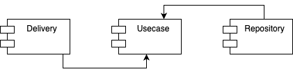

# Лабораторная работа №1, ППО
### Название проекта: **IMDb-mini**
### Краткое описание идеи проекта
Приложение для составления списков фильмов.
Можно сделать поиск фильма по названию или по жанру, стране, режиссеру, актеру и тд., после чего добавить его в свой список к просмотру.
Также можно добавить фильм в список и поставить ему лайк или дизлайк.
### Краткое описание предметной области
Приложение предназначено для кинолюбителей и используется для составления кастомных списков фильмов
### Краткий анализ аналогичных решений
|Название|Кроссплатформенность|Личный кабинет|Возможность оценить фильм|
|--------|----------|------------------------|--------------|
|IMDb-mini|+|+|+|
|IMDb|+|+|+|
|film.ru|+|-|-|
### Краткое обоснование целесообразности и актуальности проекта
Кроссплатформенный сервис для составления списка фильмов позволит масштабировать систему не только для настольный компьютеров, но и для мобильных устройств без дополнительных затрат на переписывание бизнес логики.
Такой сервис будет очень полезен кинолюбителям, которые хотят вести историю своих просмотров, а также откладывать фильмы для просмотра в будущем.

### Use-Case - диаграмма

### ER-диаграмма сущностей

### Пользовательские сценарии;
1. Авторизоваться, перейти на страницу создания нового списка, создать список (указав его название).
2. Авторизоваться, перейти на страницу поиска фильмов, ввести название фильма, перейти на страницу фильма, добавить фильм в свой список, указав его название.
3. Авторизоваться, перейти на страницу поиска фильмов, добавить фильтр по жанру (выбрав из списка), перейти на страницу фильма, добавить фильм в свой список, указав его название.
4. Авторизоваться, перейти на страницу поиска фильмов, добавить фильтр по режиссеру (указав его имя), перейти на страницу фильма, добавить фильм в свой список, указав его название.
5. Авторизоваться, перейти на страницу поиска фильмов, добавить фильтр по актеру (указав его имя), перейти на страницу фильма, добавить фильм в свой список, указав его название.
6. Авторизоваться, перейти на страницу поиска фильмов, добавить фильтр по стране (указав ее название), перейти на страницу фильма, добавить фильм в свой список, указав его название.
7. Авторизоваться, перейти на страницу поиска фильмов, ввести название фильма, перейти на страницу фильма, оценить фильм.
8. Авторизоваться, перейти на страницу своих списков, перейти на страницу, перейти на страницу конкретного списка, перейти на страницу фильма, оценить фильм.
9.  Зайти на страницу авторизации, авторизироваться или перейти на страницу регистрации.

### Формализация бизнес-правил.

# Лабораторная работа №2, ППО

## Описание типа приложения и технологического стека

Приложение консольного типа, технологический стек: GoLang, PostgreSQL

## Верхнеуровневое разбиение на компоненты

## UML диаграммы классов

### UML диаграмма сущностей БД

### UML диаграмма классов

