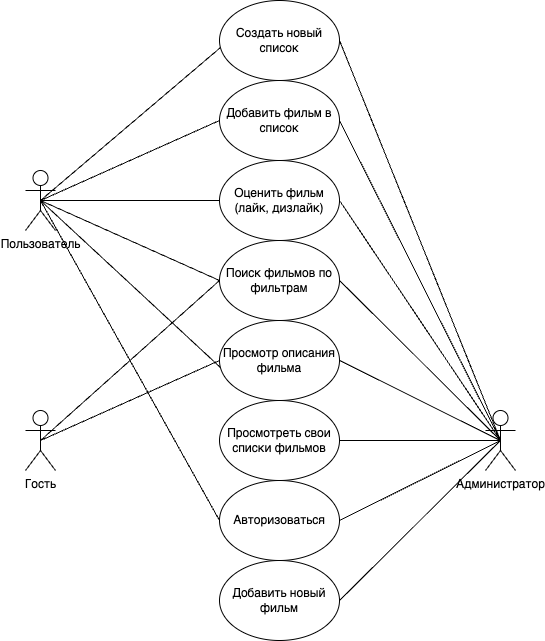

# Лабораторная работа №1, ППО
### Название проекта: **IMDb-mini**
### Краткое описание идеи проекта
Приложение для составления списков фильмов.
Можно сделать поиск фильма по названию или по жанру, стране, режиссеру, актеру и тд., после чего добавить его в свой список к просмотру.
Также можно добавить фильм в список и поставить ему лайк или дизлайк.
### Краткое описание предметной области
Приложение предназначено для кинолюбителей и используется для составления кастомных списков фильмов
### Краткий анализ аналогичных решений
|Название|Кроссплатформенность|Личный кабинет|Возможность оценить фильм|
|--------|----------|------------------------|--------------|
|IMDb-mini|+|+|+|
|IMDb|+|+|+|
|film.ru|+|-|-|
### Краткое обоснование целесообразности и актуальности проекта
Кроссплатформенный сервис для составления списка фильмов позволит масштабировать систему не только для настольный компьютеров, но и для мобильных устройств без дополнительных затрат на переписывание бизнес логики.
Такой сервис будет очень полезен кинолюбителям, которые хотят вести историю своих просмотров, а также откладывать фильмы для просмотра в будущем.

### Use-Case - диаграмма

### ER-диаграмма сущностей (не путать с диаграммой БД – диаграмма сущность-связь не приземлена на конкретную СУБД и показывает сущности системы)

### Пользовательские сценарии (в текстовом виде);
1. Авторизоваться, зайти на страницу своего профиля, создать / удалить собственный список.
2. Авторизоваться, зайти на страницу конкретного фильма, добавить / исключить в собственную подборку.
3. Посмотреть фильмы, добавить фильтр по жанру.
4. Посмотреть фильмы, добавить фильтр по режиссеру.
5. Посмотреть фильмы, добавить фильтр по актеру.
6. Посмотреть фильмы, добавить фильтр по стране.
7. Авторизоваться, зайти на страницу конкретного фильма, оценить фильм.
8. Авторизоваться, сделать что-то из предыдущих действий или ни одно из них, выйти из аккаунта.
9.  Зайти на страницу авторизации, авторизироваться или перейти на страницу регистрации.

### Формализация бизнес-правил (в виде BPMN).

