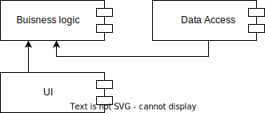
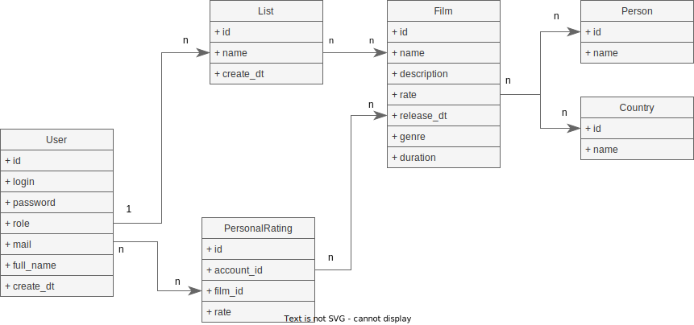
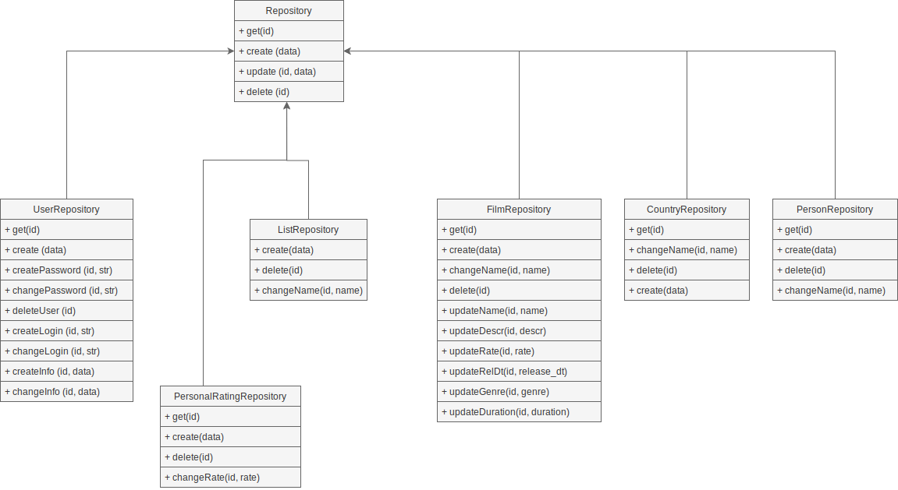

# Лабораторная работа №2, ППО

## Описание типа приложения и технологического стека

Приложение консольного типа, технологический стек: GoLang, PostgreSQL

## Верхнеуровневое разбиение на компоненты

## UML диаграммы классов

### UML диаграмма сущностей БД

### UML диаграмма компонента доступа к данным:

### UML диаграмма компонента бизнес-логики:

